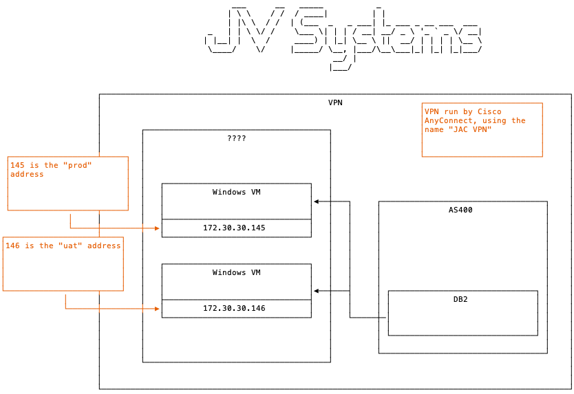
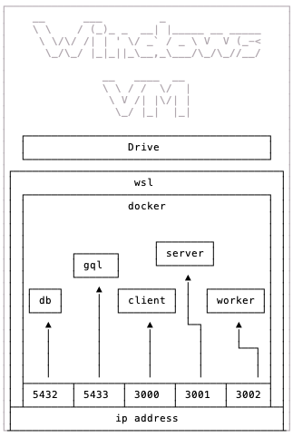
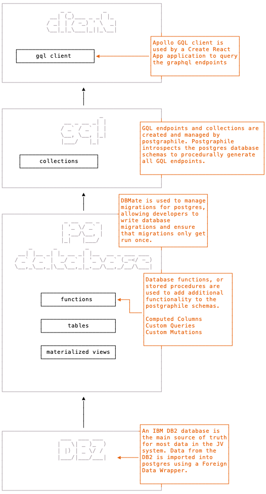

# Jac Vandenberg System

## Deployment Architecture

JV systems are deployed onto a docker instance running on a windows VM.
Applications are available over the VPN by IP address only.
Two environments are setup, UAT and Prod.



Several applications are deployed inside the docker instance, that all work together to support the main application.






## DBMate

https://github.com/amacneil/dbmate

running database migrations with dbmate, this will run any pending database migrations.

```bash
docker compose run db dbmate up
```
DB mate keeps track of which migrations have been run inside each database, giving better
control over when a migration runs. This also protects against partial migrations by
wrapping everything in a transaction and rolling it back if there was failure.


creating database migrations with dbmate

```bash
docker compose run db dbmate n <name-the-migration>
```