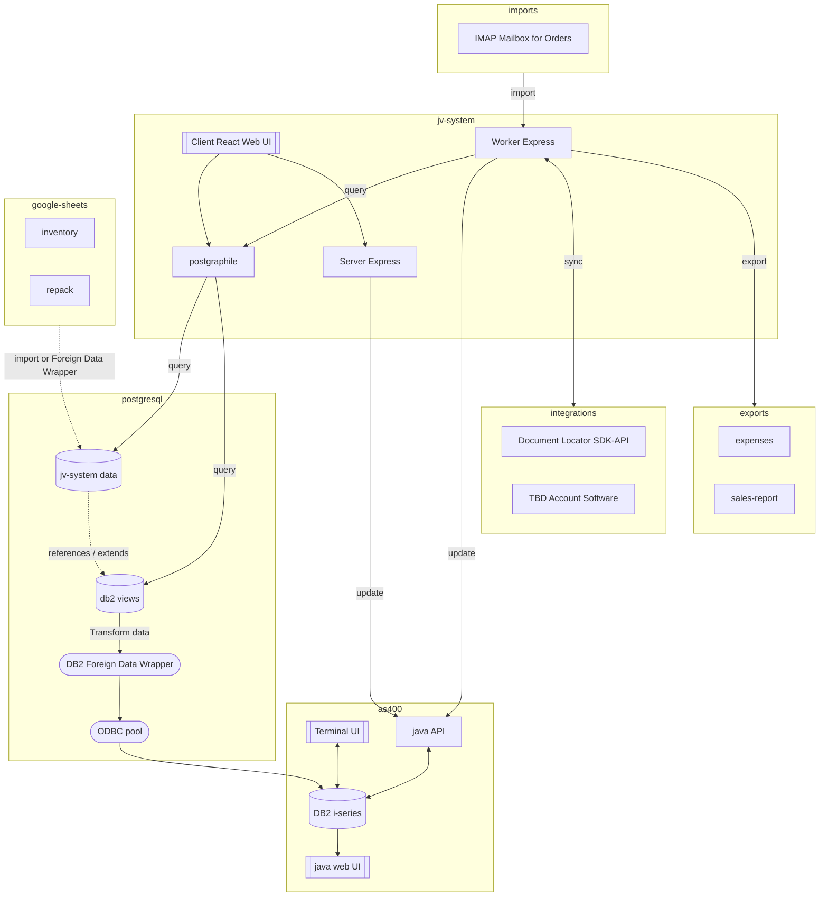

## Summary

The general approach is to develop a distributed system to extend the existing functionality of the as400. Our reasoning:
* The as400 currently operates well and efficiently for some employees
* Replacing the as400 with either custom code or an alternative ERP system would be costly and time consuming

## Goals

* Keep existing systems working
* Simplify the process of accessing and updating as400 data
* Reduce disparate data silos
* Automate existing manual tasks
* Document existing processes and data

## Overview

### Architectural Changes

#### Add Postgresql views to AS400 DB2 foreign tables

The jv-system imports the as400 db2 data as a daily process that maps the cryptic db2 column names to meaningful names in postgresql. Rather than attempting to duplicate all as400 data in the postgresql, a Foreign Data Wrapper can be added connecting to the db2 through an ODBC pool. This will:
* Map db2 fields to meaningful columns names. This creates a single point of transformation to simplify development and reporting in the jv-system application and any future application.
* Provide clearer data documentation for developers and users.
* Provide live as400 db2 to the jv-system, satisfying the needs to real time data. Using a view mapped to a as400 db2 table rather than a copied postgresql table should be a straight forward conversion.
* Provide a single source of truth for operations data
* Make exploring and querying the as400 db2 the same process as exploring and querying the jv-system data.
* Provide future options for performance improvements by caching with materialized views or other intermediary database caches.

#### Develop Java API for AS400 updates

The existing java ui may not be useful as a user UI, but it does expose the internal AS400 API. This provides a means of calling AS400 programs via java, and expose those calls as SOAP/REST/GraphQL API for other services. This would allow the jv-system and other future applications, a method of updating the AS400 state such as entering orders or add/changing inventory.

#### Import/connect repack data

Repacks are currently tracked in multiple locations by different as400 users: google sheets, Excel, 3PL warehouse inventory, and the as400 inventory. This makes it difficult to track inventory, and its source. The existing data can be imported into the jv-system data as new tables, or connected using Foreign Data Wrappers.

### Feature Changes

#### Validate/Import orders from email

The jv-system worker can be updated to connect to the mailbox that receives order submissions from growers. The worker could then attempt to process the orders to:
* Validate the order entry. Invalid orders could either be itemized to the order input employee or automatically responded to with validation errors.
* Import orders using the aforementioned java API, calling the AS400 order import programs.

This avoids the problem of convincing growers to use a new portal system by leveraging the communication they (and JV employees) are already familiar with. It also avoids the need for external connectivity and those security implications.

This process could be later extended as a grower portal to provide a more direct input method if desired.

#### Export expenses and sales reports

Expenses and sales reports are a manual and time consuming task. Creating a single source of data will provide the ability to query inventory and repacks from a single location to automate this process.

#### Connect Accounting Software

The AS400 currently does not have an option to export a general ledger but operates as an acceptable AP and AR system. The current generation of the general ledger requires the generation of two manual reports that are cross referenced to verify accuracy. Existing accounting software can be discovered fitting the accounting departments requirements and can be connected either directly to the as400 or via the jv-system work using the DB2 views.